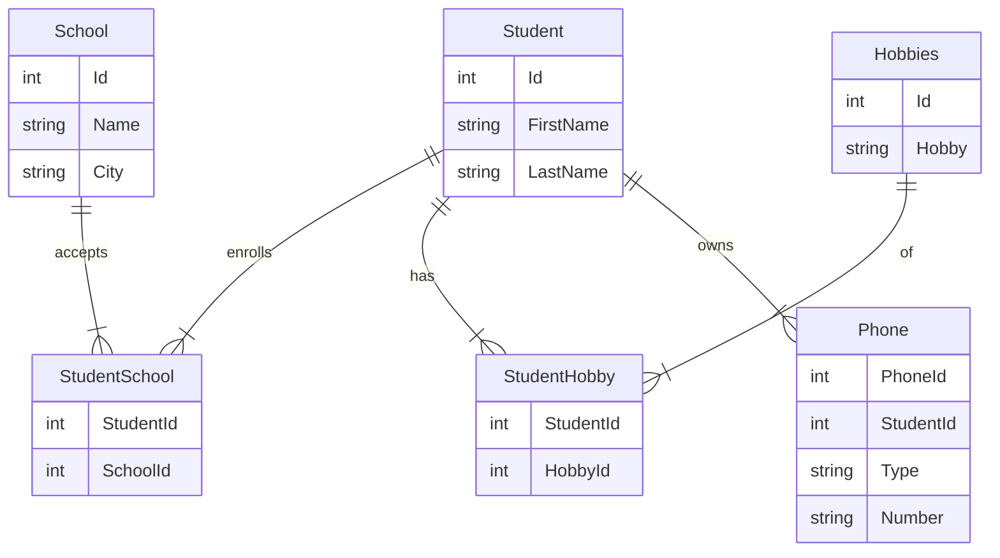

## DB2022 Inlämning(2023)

Detta är en inlämningsrepo för kursen "Utveckling mot databaser"   
på ITHS, JAVA2022.   
  
### ER-Diagram  
  

```mermaid
erDiagram
    Student ||--|{ StudentSchool : enrolls
    School ||--|{ StudentSchool : accepts
    Student ||--|{ StudentHobby : has
    Hobbies ||--|{ StudentHobby : of
    Student ||--|{ Phone : owns


    Hobbies {
    	int Id
		string Hobby
    }
    Phone {
    	int PhoneId
		int StudentId
		string Type
		string Number
    }
    StudentHobby {
	  	int StudentId
	  	int HobbyId 
    }
    StudentSchool {
        int StudentId
        int SchoolId
    }
    Student {
        int Id
        string FirstName
        string LastName
    }
    School {
        int Id
        string Name
        string City
    }
```